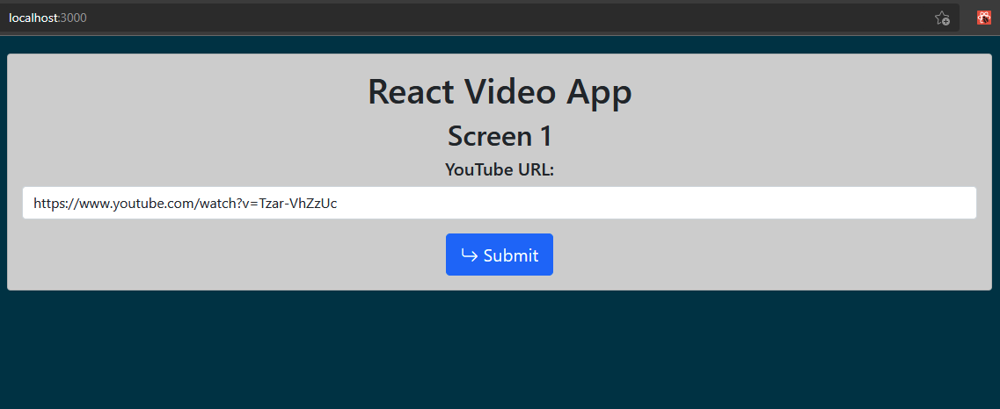
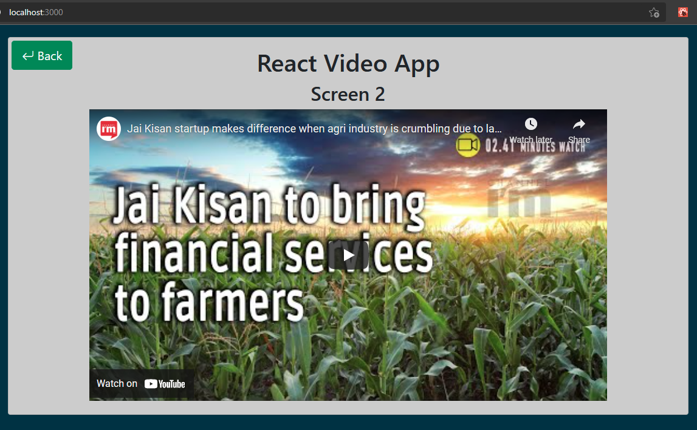
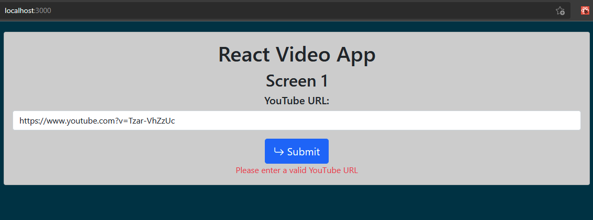
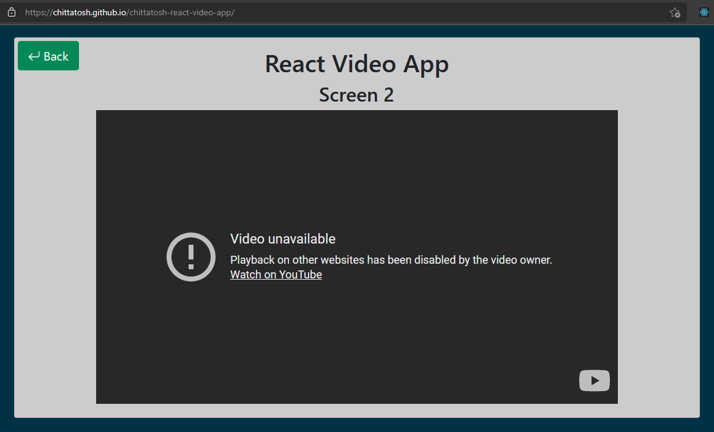

# React Video App

This project was bootstrapped with [Create React App](https://github.com/facebook/create-react-app).

## How to run this app

Download the zip from https://github.com/Chittatosh/chittatosh-react-video-app.git and extract it,\
or git clone this repo from terminal:
```bash
git clone https://github.com/Chittatosh/chittatosh-react-video-app.git
```
cd into the directory containing the package.json file:
```bash
cd chittatosh-react-video-app
```
Install the required npm packages:
```bash
npm install
```
Start the app:
```bash
npm start
```
The app will open in browser at http://localhost:3000/.
Enter any YouTube URL on screen 1 to view the YouTube video on screen 2. Click the Back button on screen 2 to return to screen 1.

## Types of supported URL
<ol>
  <li>https://youtu.be/Tzar-VhZzUc</li>
  <li>https://www.youtube.com/watch?v=Tzar-VhZzUc</li>
  <li>https://www.youtube.com/embed/Tzar-VhZzUc</li>
  <li>http://www.youtube.com/v/Tzar-VhZzUc</li>
</ol>

## Deployment
This app is deployed on https://chittatosh.github.io/chittatosh-react-video-app/.

# UI
Screen 1

Screen 2

"Please enter a valid YouTube URL" will appear on screen 1 as seen below if the user enters an invalid URL:

Playback on other websites may be disabled by the video owner for some videos as seen below:


# React components
This react app contains App as the top level stateful component. The App components contains two sub-components: UrlForm which is a stateful component for taking YouTube URL as input from the user on screen 1 and VideoPlayer which is a stateless component for showing the YouTube video on screen 2. Both UrlForm and VideoPlayer components use the common Button component for the Submit button on screen 1 and the Back button on screen 2 respectively.